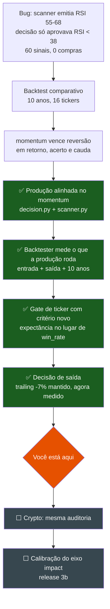

# Estratégia do pipeline B3 — estado, evidências e próximos passos

Atualizado em **2026-08-05**.

Este arquivo existe para que nenhuma decisão de estratégia precise ser refeita
por falta de memória. Cada escolha abaixo tem o número que a sustenta e o
comando que a reproduz.

---

## 1. Onde estamos



---

## 2. A estratégia de produção hoje

| etapa | onde | regra |
|---|---|---|
| varredura | `b3/scanner.py` | 14 tickers fixos + top-20 Brapi |
| sinal | `b3/scanner.py` | preço > EMA-20 **e** `55 < RSI < 68` |
| pré-gate de IA | `b3/decision.py` | audita só dentro da faixa de compra |
| auditoria | `core/sentiment_analyzer.py` | consenso de 3 LLMs |
| compra FORTE | `b3/decision.py` | faixa **e** `vol > 1.5` **e** `score >= 70` |
| compra MODERADO | `b3/decision.py` | faixa **e** `vol > 1.2` **e** `score >= 55` |
| gate por ticker | `b3/decision.py` | só rebaixa MODERADO; FORTE passa direto |
| saída | `b3/monitor.py` | trailing stop -7% do topo, **sem alvo** (ver 3.3) |

O nível vivo do stop sai de `nivel_stop(pico)` (`b3/monitor.py`), fonte única
para o monitor e para o painel. Antes o painel mostrava `entrada * 0.93`
gravado na compra: numa posição com lucro ele prometia um preço de saída que o
robô não executava mais.

**Os dois níveis compartilham a mesma faixa de RSI.** O que separa FORTE de
MODERADO é volume e score, não RSI — então não existe rebaixamento de FORTE
para MODERADO por RSI.

---

## 3. O que foi testado, e o que cada teste respondeu

Todos os números: 10 anos, 16 tickers B3, líquido de 0,2% de custo por trade.

### 3.1 momentum vs reversão — **decidiu a estratégia**

Sob a saída que a produção executa (trailing stop):

| regra | n | acerto | retorno/trade | perda além de -10% |
|---|---|---|---|---|
| **momentum** | 1204 | **40,9%** | **+1,16%** | **1,0%** |
| reversão | 718 | 38,3% | +0,52% | 1,3% |

Momentum ganha nos três eixos, e **ganha nos dois regimes de mercado** (IBOV
acima e abaixo da MA200). Sem cruzamento, não há caso para regime-switching.

Reproduz: `python scripts/compare_entry_rules.py --anos 10 --saida "trailing (producao)"`

### 3.2 Ideias testadas e **descartadas**

| ideia | resultado | por que foi descartada |
|---|---|---|
| **Filtro de EMA-20** | Em 19.474 velas, só **13** tinham RSI 55-68 com preço abaixo da EMA | Redundante com o RSI. A média móvel não acrescenta informação que o RSI já não tenha |
| **`reversao_em_alta`** (comprar queda dentro de alta) | **0 trades** em 10 anos | Conjunto vazio: das 2.506 velas com RSI < 38, nenhuma tinha preço acima da EMA-20 |
| **Filtro de ADX** (lateralização vs tendência) | Reprovou em acerto, retorno **e** cauda. Reversão + ADX<20: 40,7% vs 40,8% sem filtro | Cortou 60% das operações sem entregar nada. A melhora aparente da cauda era artefato de amostra menor |
| **Filtro de volume no momentum** | `vol>1.2` deu +1,46% vs +1,16%, dentro de 1 erro padrão. `vol>1.5` saiu **pior** que `vol>1.2` | Não-monotônico = ruído. Os thresholds de produção ficaram como estavam |
| **União das duas teses (OR)** | Correlação diária de apenas **0,168** | Correlação baixa favorece diversificação, mas a união do backtester disputa a mesma vaga de posição — não mede dois books independentes. Pergunta segue **aberta** |
| **Regime-switching por IBOV** | Momentum ganha em alta (44,1%) **e** em baixa (53,3%) | Critério pré-registrado: só construir se houvesse cruzamento. Não houve |
| **Modelo de ML sobre análise gráfica** | Não implementado | Os dois filtros determinísticos mais óbvios (EMA, ADX) não acharam sinal. Com 466-740 exemplos e sem walk-forward, um modelo produziria backtest bonito e comportamento vivo desconhecido |

### 3.3 Modelos de saída — **decidido em 2026-08-05: fica o trailing de -7%**

Mesmas entradas de momentum, só a saída varia:

| saída | retorno/trade | perda além de -10% |
|---|---|---|
| stop fixo + alvo +15% (ordem real) | **+2,02%** | 2,2% |
| trailing -7% do topo (**produção**) | +1,16% | **1,0%** |
| trailing -7% **+ alvo +15%** | +0,86% | 1,1% |
| conferência no fechamento (não implementável) | +2,81% | 7,2% |

**Acrescentar alvo ao trailing foi descartado.** A hipótese era que o +2,02% do
stop fixo viesse do alvo realizando lucro. Não vem: com alvo, o mesmo balde de
saídas por stop cai de **+1,2%** para **-2,4%** de retorno médio, porque os
ganhadores grandes saem antes pelo alvo e sobram os medianos. O alvo não
acrescenta realização de lucro — **trunca** a que o ratchet já fazia. Perde em
retorno *e* em pior caso (-24,2% contra -20,5%), então não é trade-off.

O que separava as duas primeiras linhas não era o alvo: era a **largura** do
stop. Varredura de 8 larguras, mesmas entradas, 10 anos:

| trailing | retorno líq. 10a | DD máx | **Sharpe** | retorno/trade |
|---|---|---|---|---|
| -5% | 40% | -14,1% | 0,88 | +0,33% |
| -6% | 92% | -15,4% | 1,12 | +0,74% |
| **-7% (produção)** | 132% | **-14,6%** | **1,14** | +1,16% |
| -8% | 123% | -18,3% | 1,00 | +1,42% |
| -9% | 152% | -23,1% | 0,84 | +1,93% |
| -10% | 191% | -18,8% | 0,91 | +2,63% |
| -12% | 299% | -23,9% | 0,82 | +4,45% |
| -15% | 397% | -25,0% | 0,85 | +7,22% |

O -7% entrou no commit `e3b9f35` — o mesmo que criou o `monitor.py` — e nunca
foi tocado nem medido até aqui. Medido, **está no pico da curva de Sharpe**. O
-6% empata dentro do ruído; de -8% em diante cai e não volta.

Três leituras que a tabela esconde:

- **Retorno/trade não serve para escolher largura.** Stop mais largo dispara
  menos, então cada operação dura mais e rende mais *por operação* — por
  construção, não por vantagem. Por isso a coluna de carteira equal-weight
  existe: mesmo denominador de 10 anos para todas as larguras.
- **O bruto sobe até -15% porque trailing largo vira buy-and-hold.** Os 397%
  são majoritariamente a deriva de um mercado que subiu em 2015-2025. É aposta
  em regime, não vantagem medida — e o Sharpe cobra o preço.
- **A frequência de perda além de -10% vira artefato acima dessa largura.** Com
  trailing de -12%, toda saída normal por stop perde 12% e entra na conta; daí
  o salto de 1,8% para 17%. O número comparável entre larguras é o `pior`, que
  fica em **-20,5% em todas** — pior caso é gap, e nenhuma largura muda gap.

**Estabilidade:** partindo os 10 anos ao meio (corte em 2021-08), toda largura
rende menos na segunda metade (-7%: +1,46% contra +0,81% por trade). A *ordem*
entre as larguras se mantém nas duas metades; o *nível* não. Mais uma razão
para não perseguir o topo de uma varredura.

Reproduz:
```
python scripts/compare_entry_rules.py --anos 10 --estudo saida
python scripts/compare_entry_rules.py --anos 10 --estudo varredura
```

### 3.4 Classificação de tickers

| classe | tickers | critério |
|---|---|---|
| prioritários | PETR4, ITUB4, VALE3, SBSP3, WEGE3, BBDC4 | sharpe >= 0,5 |
| observação | PRIO3, SUZB3, GGBR4, RENT3, RDOR3, B3SA3, EQTL3, VBBR3 | sharpe > 0 |
| fora | CSAN3 (sharpe -0,13) | sharpe <= 0 |

A lista anterior vinha da reversão e estava desalinhada: **B3SA3 era
prioritário sendo 12º de 15**, e **WEGE3 estava banido sendo 5º**.

Reproduz: `python scripts/rank_tickers.py`

### 3.5 Gate de aprovação por ticker

Critério antigo — `win_rate >= 55% AND sharpe >= 0.5` — aprovava **zero**
tickers sob a régua correta e caía permanentemente no fallback escrito à mão.
Não era culpa dos ativos: sem alvo fixo, o trailing stop corta o ganhador cedo
e a taxa de acerto fica em 35-53% **por construção**.

Critério atual (`b3/decision.py`, `ticker_aprovado`):

```
total_trades >= 30  AND  avg_return_pct > 0.2%  AND  sharpe_ratio >= 0.5
```

Aprovados: **ITUB4, PETR4, SBSP3, VALE3, WEGE3**.

---

## 4. Armadilhas conhecidas

**Nunca rode `python -m b3.backtester` durante o pregão sem conferir o log.**
O yfinance publica a vela do dia em andamento com `Open/High/Low = 0` e só o
`Close`. Os modelos de saída leem OHLC: `abertura=0` satisfaz
`abertura <= stop` sempre, e a posição aberta "sai" a preço zero — um trade de
**-100%** inventado que desloca a média do ticker inteiro. Está tratado (as
velas inválidas são descartadas com um `[INFO]`), mas o arquivo gerado no meio
do dia simplesmente ignora o dia corrente.

**`data/backtest_results.json` é versionado de propósito.** Sem isso o GitHub
Actions nunca o encontra e o gate cai numa lista fixa escrita à mão. Versionado,
a lista aprovada muda por commit revisado, não sozinha a cada execução. Ele
envelhece — o campo `generated_at` diz de quando é.

**Vieses que valem para todos os números acima:**
- Universo só tem empresas que sobreviveram 10 anos (viés de sobrevivência).
- Retornos em reais nominais, sem deflacionar. Cancela na comparação entre
  regras, não vale como retorno real.
- Nenhum estudo simula o gate da IA nem o macro — a produção é mais restritiva,
  então todo retorno acima é otimista.
- `max_drawdown` do backtester é por ticker com 100% do capital. A produção
  aloca 10-20%, então divida na mesma proporção.

---

## 5. Próximos passos

### 5.1 Auditoria do crypto (próximo)
`crypto/` não foi tocado. Sabemos que:
- **O bug das faixas não existe lá.** `crypto/scanner.py` não filtra por RSI —
  emite tudo e deixa `crypto/decision.py` filtrar (RSI <= 32 forte / <= 40
  moderado, com aperto dinâmico em tendência de baixa).
- **Só existe a tese de reversão.** Não há faixa de momentum para comparar.
- **Não verificamos** se `crypto/monitor.py` tem o mesmo descasamento de saída
  que achamos no B3. Apareceu nos outros dois lugares; vale checar.
- Dado de backtest: klines da Binance, grátis, endpoint público, histórico
  desde ~2017. `crypto/scanner.py:98` já usa essa API.

### 5.2 Reavaliar posição aberta com informação (ideia guardada)
Hoje a IA opina **só na compra**. Depois que a posição abre, `b3/monitor.py` lê
exclusivamente preço do yfinance: não relê notícia, não reconsulta a IA, não
reavalia a tese. O único elemento não-preço é o alerta macro, que manda
Telegram e **não vende nada**.

A ideia é deixar a IA segurar uma posição que o trailing venderia, quando a
notícia indica continuação da alta. Alargar o stop é a versão *cega* disso — e
3.3 mostra que ela custa Sharpe. A versão com informação não é mensurável hoje:
não existe histórico de decisões da IA para simular contra o preço que veio
depois. O caminho honesto é o mesmo do `impact` — **coletar primeiro**, gravando
a opinião da IA sobre posições abertas sem deixá-la decidir nada, e só calibrar
quando houver amostra. Ligar isso com threshold chutado é overfitting com
dinheiro real.

### 5.3 Pendências herdadas
- **FORTE vs MODERADO sem validação.** FORTE aloca o dobro (20% vs 10%) com
  base em `vol > 1.5` e `score >= 70`. O eixo de volume não mostrou vantagem
  (ver 3.2) e o de score nunca foi backtestado — o backtest não simula IA.
- **Diversificação não medida.** A correlação de 0,168 entre as duas teses
  favorece manter as duas, mas isso exige dois books independentes com Sharpe
  da combinação, que o backtester atual não faz.
- **Calibração do eixo `impact`** (release 3b) segue com a coleta ligada
  (`AI_PREGATE=off` nos dois workflows). Avaliar com
  `python scripts/analyze_impact.py --triagem`. Abortar se mais de 70% das
  amostras ficarem em `|impact| <= 10` ou se a correlação com `score` passar
  de 0,9.
- **9 linhas com caractere fora do cp1252 em `print`** (`b3/validator.py`,
  `crypto_main.py`, `scripts/setup_supabase_v2.py`) derrubam o script em
  console Windows. A do backtester foi corrigida; as outras não.
